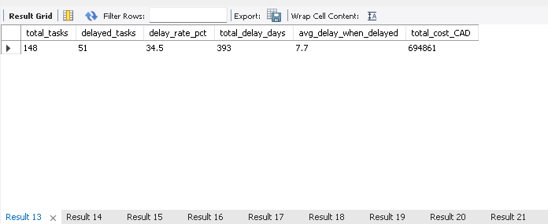
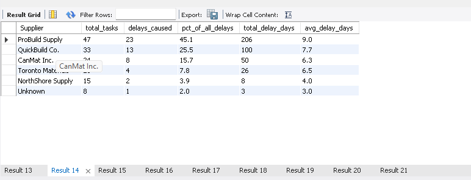
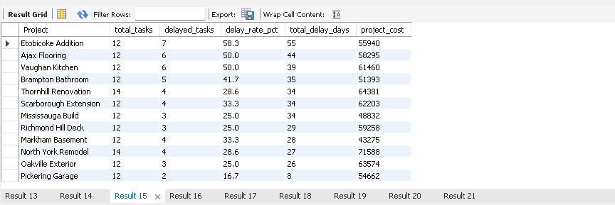
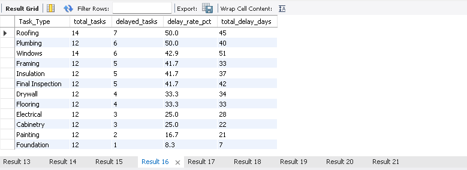
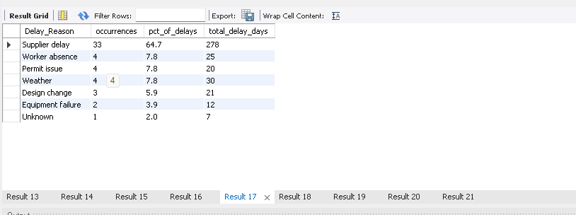
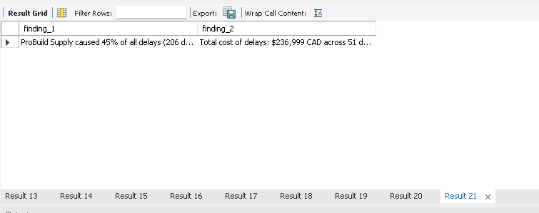

# Construction Delays Analysis — MySQL

**Project 2 of 3 | Data Analytics Portfolio**
**Author:** Stiven Peña | [github.com/stivenpena-data](https://github.com/stivenpena-data)

---

## Business Problem

A construction project management firm tracks 12 active projects across the Greater Toronto Area. Delays are accumulating but no one knows **which supplier is causing the most damage**. This analysis identifies the root cause and quantifies the financial impact.

---

## Key Findings

| Finding | Value |
|---------|-------|
| Overall delay rate | **34.5%** of all tasks delayed |
| Total delay days | **393 days** lost across all projects |
| Total cost of delayed tasks | **$236,999 CAD** |
| #1 delay cause | **ProBuild Supply — 45% of all delays** |
| Days lost to ProBuild Supply | **206 days** |
| Worst project | **Etobicoke Addition** — 58.3% delay rate |

> **Bottom line:** One supplier is responsible for nearly half of all construction delays. Replacing or renegotiating with ProBuild Supply is the highest-leverage action available.

---

## Dataset

| Attribute | Value |
|-----------|-------|
| Source | Synthetic dataset (realistic construction PM data) |
| Rows | 148 tasks across 12 projects |
| Columns | 12 (Task_ID, Project, Task_Type, Worker, Supplier, Dates, Delay_Days, Cost_CAD, etc.) |
| Dirty data injected | 10 types of quality issues |

**10 data quality issues cleaned:**
1. Duplicate Task_IDs
2. NULL supplier names
3. Supplier name inconsistencies (`ProBuild Supply` / `Probuild supply` / `PROBUILD SUPPLY`)
4. Negative delay days (impossible values)
5. Logical inconsistency: `On_Time = Yes` with `Delay_Days > 0`
6. Missing delay reasons on delayed tasks
7. Wrong date format (`MM/DD/YYYY` instead of `YYYY-MM-DD`)
8. Zero and missing cost values
9. Worker name inconsistencies
10. Non-numeric values in numeric columns

---

## Tools & Stack

- **MySQL 8.0** — database, cleaning, analysis
- **MySQL Workbench** — query editor
- **Python** (`mysql-connector-python`) — CSV import script
- **Power BI** *(dashboard — coming soon)*

---

## Project Structure

```
Project 2/
├── 01_create_and_load.sql   # Create database + raw table schema
├── 02_data_cleaning.sql     # Data quality assessment + 9-step cleaning
├── 03_analysis.sql          # 7 business insights + key findings
├── import_csv.py            # Python script to load CSV into MySQL
└── screenshots/
    ├── 01_overall_performance.png
    ├── 02_delays_by_supplier.png
    ├── 03_delays_by_project.png
    ├── 04_delays_by_tasktype.png
    ├── 05_delays_by_reason.png
    └── 06_key_findings.png
```

---

## Analysis Results

### Overall Performance


### Delays by Supplier — The Key Finding


> ProBuild Supply leads with **45% of all delays** and **206 days** of accumulated delay time across all projects.

### Delays by Project


### Delays by Task Type


### Delays by Reason


### Key Findings Summary


---

## How to Reproduce

**Prerequisites:** MySQL 8.0, Python 3.x, `mysql-connector-python`

```bash
pip install mysql-connector-python
```

**Steps:**
1. Run `01_create_and_load.sql` in MySQL Workbench — creates the database and raw table
2. Run `python import_csv.py` — loads the CSV into `delays_raw`
3. Run `02_data_cleaning.sql` — assesses data quality and cleans all 10 issues
4. Run `03_analysis.sql` — executes all 7 insights and outputs key findings

---

## Skills Demonstrated

- SQL database design and schema planning
- Real-world data cleaning (10 types of dirty data)
- Aggregation, CASE logic, GROUP BY, CTEs
- Business insight extraction from raw data
- Python + MySQL integration
- Translating data findings into business recommendations

---

## Business Recommendations

1. **Audit ProBuild Supply** — 45% of delays from one supplier is a critical risk. Review contract SLAs.
2. **Prioritize Etobicoke Addition** — Highest delay rate (58.3%) and $55,940 at risk.
3. **Target Procurement phase** — Task type analysis shows procurement as the highest-risk phase.
4. **Implement delay tracking alerts** — Automate flagging when `Delay_Days > 5` to catch problems earlier.

---

*Part of a 3-project portfolio demonstrating end-to-end data analytics skills: SQL → Power BI → Python.*
